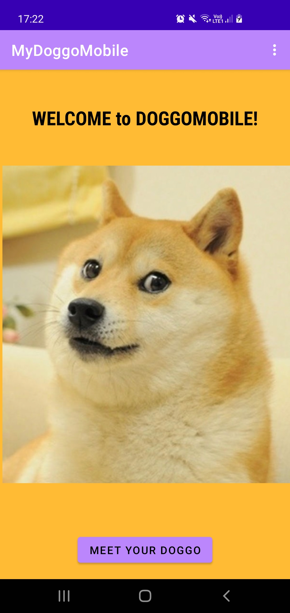
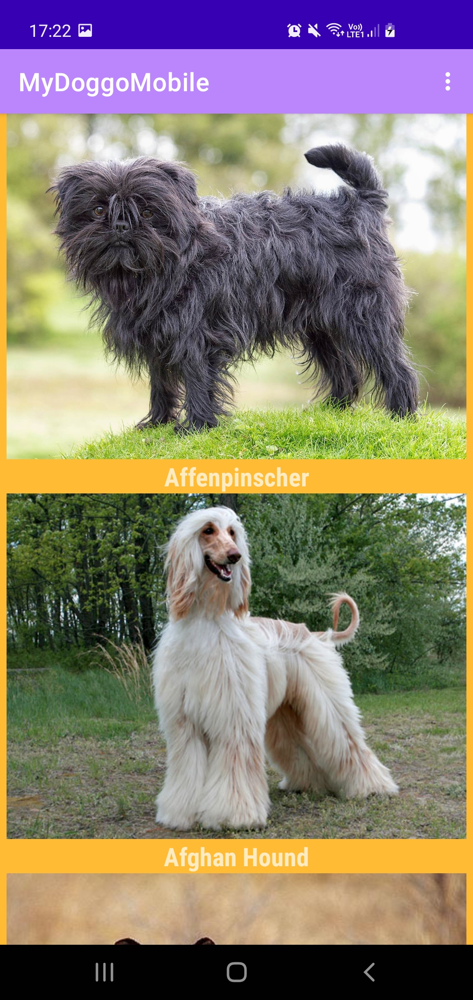
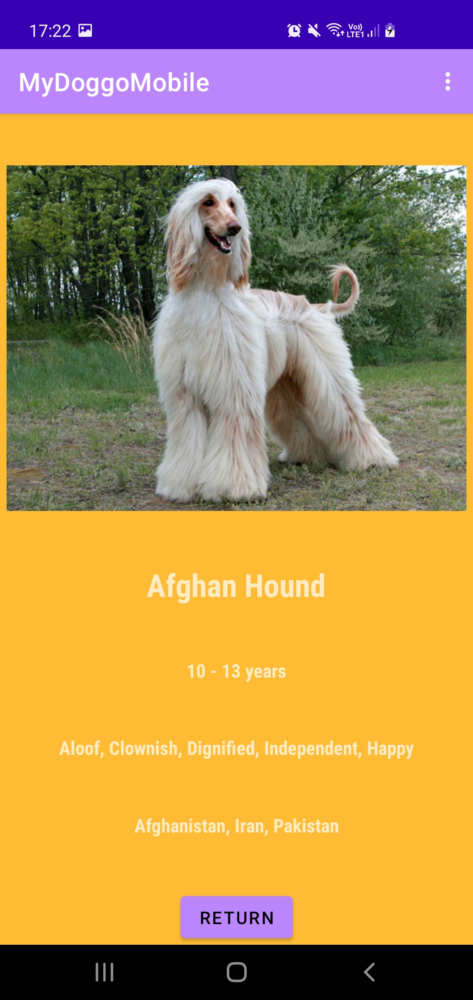

# MyDoggoMobile

## Description du projet

L’application MyDoggoMobile a pour but de présenter plusieurs races de chiens à l’utilisateur, lui permettant de connaître autre chose que le Golden Retriever, le Yorkshire ou le Chihuahua. L’application se compose d’une page d’accueil donnant accès à une liste de chiens, chacun possédant une page de description avec sa photo, son nom, son espérance de vie, son tempérament et son origine (quand celle-ci est connue et répertoriée).

Le projet est basé sur une architecture MVVM.

L’API utilisée pour ce projet : https://dog.ceo/dog-api/
## Logiciels utilisés
- Android Studio

(Si cela n'est pas déjà fait, installer Android Studio ici -> https://developer.android.com/studio)

## Captures d'écran

<table>
  <tr>
    <th>Écran d'accueil</th>
    <th>Liste des chiens</th>
    <th>Détails d'un élément</th>
  </tr>
  <tr>
    <td>
      
    </td>
    <td>

    </td>
    <td>
      
    </td>
   <tr>
  <table>

